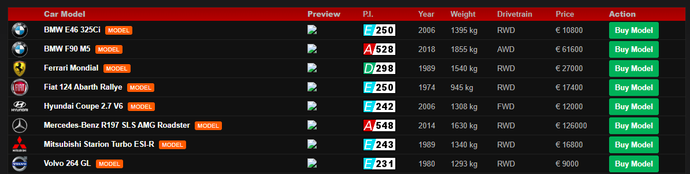

# browser-racing-game-revival
Legacy browser-based racing game seeking collaborators for modernization.

# Browser Racing Game Revival

## What This Is
This is a legacy browser-based racing management game that was originally built in 2009 and I bought it in 2019 as a systems-heavy project focused on cars, parts, stats, and progression. The game already includes functioning dealership, engine, inventory, and pricing systems, but the underlying architecture and UI are outdated. I’m looking to modernize and clean up the codebase rather than start over from scratch. This repository exists to find collaborators interested in helping revive and reshape the project.

## What Already Exists
- Core gameplay systems
- Car dealership & inventory
- Engine & parts systems
- Stats, pricing, progression logic

## Why This Needs Help
The game was built over a long period of time using patterns and assumptions that made sense then, but don’t hold up well now. The codebase is tightly coupled, hard to extend, and not friendly to iteration or UI improvements. While the core systems work, making meaningful changes or adding new features has become increasingly difficult. I’m looking for help refactoring, reorganizing, and modernizing the structure so the project can evolve again.

## The Vision
The goal of this project is to revive and modernize a system-heavy browser-based racing game while preserving the depth that made it interesting to revamp in the first place. The game is intended to balance meaningful simulation and approachability, focusing on cars, parts, progression, and tradeoffs rather than flashy presentation.

Modernization means improving the underlying architecture, separating concerns more cleanly, and creating a UI that supports the mechanics instead of obscuring them. This is envisioned as a long-term, evolving project rather than a rushed rebuild, with an emphasis on maintainability, clarity, and thoughtful iteration. Commercialization is not a current goal, but the project is being shaped with enough care that future options remain open.

## Who I Am
I’m the fourth owner of this project and have been working on it on and off since 2019 as a system-driven game. My background with the project spans both design and programming, with a stronger emphasis on systems thinking, mechanics, and long-term structure.

I’m looking to collaborate rather than work in isolation at this stage. I value open discussion, mutual respect, and realistic scope, and I see collaborators as true partners in shaping the project’s future. While the original vision matters to me, I’m open to ideas and alternative approaches as long as changes are made deliberately and in service of the game’s core goals. In terms of design, the game was built around a high degree of mechanical flexibility. Engines are not locked to specific vehicles, body kits are designed to be compatible across a large portion of the car roster, and players can customize elements such as license plates, paint, and parts. These systems were intentional and form part of what makes the project interesting to revisit rather than replace.

## What Help I’m Looking For
I’m not looking for a single “hero dev” or a quick fix. I’m looking for one or two or even three collaborators who enjoy untangling legacy systems and helping shape a cleaner foundation.

Areas where help would be especially valuable:
- Reviewing and understanding the existing codebase
- Helping plan a more modern architecture (without throwing everything away blindly)
- Backend or systems-focused refactoring
- Frontend/UI modernization and separation of concerns
- General technical guidance and second opinions

I’m open to different levels of involvement — from occasional guidance to hands-on refactoring — as long as expectations are clear and realistic.

## Compensation
This is an unpaid, volunteer passion project.

## Why You Might Want to Help
This project may be a good fit if you:
- Enjoy legacy code archaeology and refactoring challenges
- Like system-heavy games and simulation logic
- Want visible impact on a real project, not a tutorial
- Are interested in collaborative problem-solving without corporate pressure
- Appreciate honesty about scope, limitations, and goals
- If you enjoy system design that prioritizes flexibility — for example, allowing engines and cosmetic parts to work across many vehicles instead of being hard-locked — this project may be especially interesting.

## Design & Feature Mockups
### Dealership & Vehicle Browsing

Mockup of the planned dealership and vehicle browsing system, including stats, pricing, and availability.

### Reservation & Inventory Flow

Design concept for vehicle reservation and inventory management logic.

### Engine & Parts System

Mockup illustrating the intended modular engine system with performance stats and upgrade paths.

## Contact
- Email: RedStingray73@gtracer.net

